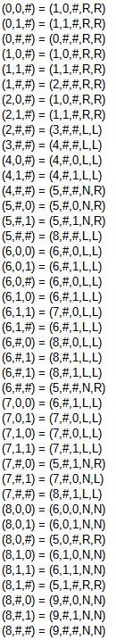

# Introduction 
Turing machine with 2 tapes (input and output) for sum of binary numbers

# Resources
Lectures materials, Python Docs, ...

# Transitions


# Getting Started
Just run ```python sum_of_all_numbers.py ##<number1>#<number2>#...##``` from command line.

# Example
<code>python sum_of_all_numbers.py ##101#1001#10##</code>
# Result:
## Binary coded machine section:
```
Binary coded:
11101001010010010100100110100010100100010100100110101010101010010011001001010010010100100110010001010010001010010011001010100010101001001100010010100100101001001100010001010010001010010011000101010000101010101100001010100000101010101100000100101000001010010101100000100010100000101000101011000001010100000010101000100110000001010010000001010010001001100000010100010000001010001000100110000001010100000000010101010110000000100100100000001010010101100000001001000100000001010001010110000000100101000000010100101011000000010001001000000010100010101100000001000100010000000010100101011000000010001010000000101000101011000000010100100000000010100101011000000010100010000000001010001010110000000101010000001010100010011000000001001001000000010100010101100000000100100010000000010100101011000000001000100100000000101001010110000000010001000100000000101000101011000000001010010000001010001000100110000000010100010000000010100100010110000000010101000000000101000101011000000000100101000000100101001001100000000010001010000001000101001001100000000010100100000000001010010001000110000000001010001000000000010100010001000110000000001010100000000001010100010001100000000010010001000000010010001000100011000000000100010010000000100010010001000110000000001001001000000010010010001000110000000001000100010000000100010001000100011111
```

## Input:
```code
Input:
##101#1001#10##
```

## Steps:
```
State: 0
##101#1001#10## // input tape with red current position
############### // output tape with red current position

δ(0, #, #) = (0, #, #, RIGHT, RIGHT) // transition function
-----------------------------------
```

## Output:
```
Output:
########10000##
```

# Binary code of machine
#### Begin ```111```
#### End ```111```
#### Separator ```11```
#### Transition inner separator ```1```

## Transition
```δ(0, 0, #) = (1, 0, #, RIGHT, RIGHT)```

current state = 0 -> 0

*alphabet is ["#","0","1"]*<br>
current value tape 1 = 0 -> 00<br>
current value tape 2 = # -> 0

new state = 1 -> 00

new value tape 1 = 0 -> 00<br>
new value tape 2 = 0 -> 0

*movements are [LEFT,RIGHT,NONE]*<br>
movement on tape 1 = RIGHT(1) -> 00<br>
movement on type 2 = RIGHT(1) -> 00

result ```01001010010010100100```